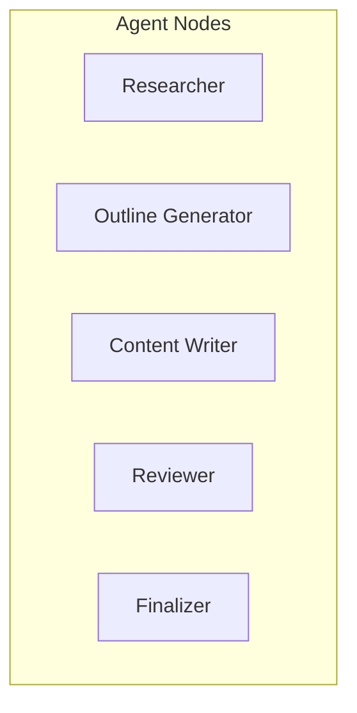
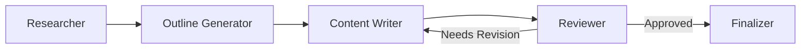
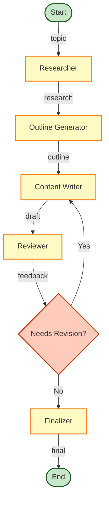

# Blog Generator Graph Structure

This document provides a detailed visualization and explanation of the graph structure used in our multi-agent blog generation system.

## Graph Overview

The blog generation workflow is implemented as a directed graph with conditional edges using Langgraph's `StateGraph`. The graph orchestrates the flow of information between specialized agents, each responsible for a specific part of the blog creation process.

## State Schema

The shared state that flows through the graph is defined as:

```python
class BlogState(TypedDict):
    topic: str          # The blog topic provided by the user
    research: str       # Research findings from the Researcher agent
    outline: str        # Structured outline from the Outline Generator
    draft: str          # Blog post draft from the Content Writer
    feedback: str       # Review feedback from the Reviewer
    final: str          # Final approved blog post
    current_step: str   # Tracks the current position in the workflow
```

## Nodes (Agents)

Each node in the graph represents a specialized agent with a specific function:



### Node Functions

1. **Researcher**
   - **Input**: Topic
   - **Process**: Gathers information about the topic
   - **Output**: Updates `state["research"]`
   - **Implementation**:
   ```python
   def research(state: BlogState) -> BlogState:
       researcher = create_researcher_agent()
       research_results = researcher.invoke({"topic": state["topic"]})
       state["research"] = research_results
       state["current_step"] = "research_completed"
       return state
   ```

2. **Outline Generator**
   - **Input**: Research findings
   - **Process**: Creates a structured outline
   - **Output**: Updates `state["outline"]`
   - **Implementation**:
   ```python
   def create_outline(state: BlogState) -> BlogState:
       outline_generator = create_outline_generator()
       outline = outline_generator.invoke({"research": state["research"]})
       state["outline"] = outline
       state["current_step"] = "outline_completed"
       return state
   ```

3. **Content Writer**
   - **Input**: Research findings + Outline
   - **Process**: Writes the blog post
   - **Output**: Updates `state["draft"]`
   - **Implementation**:
   ```python
   def write_content(state: BlogState) -> BlogState:
       writer = create_content_writer()
       draft = writer.invoke({"outline": state["outline"], "research": state["research"]})
       state["draft"] = draft
       state["current_step"] = "draft_completed"
       return state
   ```

4. **Reviewer**
   - **Input**: Blog draft
   - **Process**: Reviews and provides feedback
   - **Output**: Updates `state["feedback"]`
   - **Implementation**:
   ```python
   def review_content(state: BlogState) -> BlogState:
       reviewer = create_reviewer()
       feedback = reviewer.invoke({"draft": state["draft"]})
       state["feedback"] = feedback
       state["current_step"] = "review_completed"
       return state
   ```

5. **Finalizer**
   - **Input**: Approved draft
   - **Process**: Finalizes the blog post
   - **Output**: Updates `state["final"]`
   - **Implementation**:
   ```python
   def finalize_post(state: BlogState) -> BlogState:
       state["final"] = state["draft"]
       state["current_step"] = "completed"
       return state
   ```

## Edges

Edges define the flow of information between nodes:



### Standard Edges

```python
# Add edges
workflow.add_edge("researcher", "create_outline")
workflow.add_edge("create_outline", "write_content")
workflow.add_edge("write_content", "review_content")
```

### Conditional Edges

The system includes a conditional edge that determines whether the draft needs revision or is ready for finalization:

```python
# Conditional edge function
def needs_revision(state: BlogState) -> bool:
    return "APPROVED" not in state["feedback"]

# Add conditional edges
workflow.add_conditional_edges(
    "review_content",
    needs_revision,
    {
        True: "write_content",   # If revision needed, go back to Content Writer
        False: "finalize_post"   # If approved, proceed to finalization
    }
)
```

## Complete Graph Definition

```python
def create_blog_workflow() -> Graph:
    # Initialize the graph
    workflow = StateGraph(BlogState)
    
    # Add nodes
    workflow.add_node("researcher", research)
    workflow.add_node("create_outline", create_outline)
    workflow.add_node("write_content", write_content)
    workflow.add_node("review_content", review_content)
    workflow.add_node("finalize_post", finalize_post)
    
    # Add edges
    workflow.add_edge("researcher", "create_outline")
    workflow.add_edge("create_outline", "write_content")
    workflow.add_edge("write_content", "review_content")
    
    # Add conditional edges
    workflow.add_conditional_edges(
        "review_content",
        needs_revision,
        {
            True: "write_content",
            False: "finalize_post"
        }
    )
    
    # Set entry and end nodes
    workflow.set_entry_point("researcher")
    workflow.set_finish_point("finalize_post")
    
    return workflow.compile()
```

## Visualization of State Flow



## Data Flow Example

Here's how data flows through the graph for a blog on "The Future of Quantum Computing":

1. **Initial State**:
   ```
   {
     "topic": "The Future of Quantum Computing",
     "research": "",
     "outline": "",
     "draft": "",
     "feedback": "",
     "final": "",
     "current_step": "started"
   }
   ```

2. **After Researcher**:
   ```
   {
     "topic": "The Future of Quantum Computing",
     "research": "Quantum computing uses quantum bits or qubits...",
     "outline": "",
     "draft": "",
     "feedback": "",
     "final": "",
     "current_step": "research_completed"
   }
   ```

3. **After Outline Generator**:
   ```
   {
     "topic": "The Future of Quantum Computing",
     "research": "Quantum computing uses quantum bits or qubits...",
     "outline": "1. Introduction\n2. Current State of Quantum Computing...",
     "draft": "",
     "feedback": "",
     "final": "",
     "current_step": "outline_completed"
   }
   ```

4. **After Content Writer**:
   ```
   {
     "topic": "The Future of Quantum Computing",
     "research": "Quantum computing uses quantum bits or qubits...",
     "outline": "1. Introduction\n2. Current State of Quantum Computing...",
     "draft": "The Future of Quantum Computing: Revolutionizing Industries...",
     "feedback": "",
     "final": "",
     "current_step": "draft_completed"
   }
   ```

5. **After Reviewer (Approved)**:
   ```
   {
     "topic": "The Future of Quantum Computing",
     "research": "Quantum computing uses quantum bits or qubits...",
     "outline": "1. Introduction\n2. Current State of Quantum Computing...",
     "draft": "The Future of Quantum Computing: Revolutionizing Industries...",
     "feedback": "The blog post is well-structured and informative. APPROVED",
     "final": "",
     "current_step": "review_completed"
   }
   ```

6. **Final State**:
   ```
   {
     "topic": "The Future of Quantum Computing",
     "research": "Quantum computing uses quantum bits or qubits...",
     "outline": "1. Introduction\n2. Current State of Quantum Computing...",
     "draft": "The Future of Quantum Computing: Revolutionizing Industries...",
     "feedback": "The blog post is well-structured and informative. APPROVED",
     "final": "The Future of Quantum Computing: Revolutionizing Industries...",
     "current_step": "completed"
   }
   ```

## Extensibility

The graph structure is designed to be easily extensible:

1. **Adding New Agents**: Define a new node function and add it to the graph
2. **Modifying the Workflow**: Adjust edges to change the flow between agents
3. **Adding Conditions**: Create new conditional functions for more complex branching
4. **Expanding State**: Add new fields to the state schema for additional information
